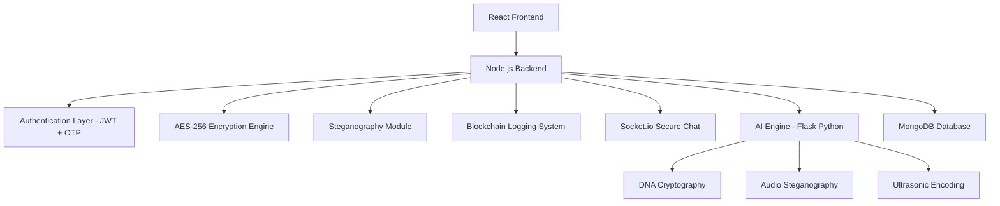

<div align="center">

# 🔐 SecureVault  
### ⚡ AI-Powered Cybersecurity & Secure Communication System


</div>

---

# 👩‍💻 About the Project

SecureVault is a **next-generation cybersecurity platform** that combines modern security technologies into one intelligent system.

The platform demonstrates real-world implementations of:

- AES-256 Military Grade Encryption
- AI-based Steganography
- Blockchain Audit Logging
- Secure Real-Time Communication
- JWT + OTP Authentication
- DNA Cryptography & Audio Encoding

It is designed as a futuristic cyber defense dashboard capable of protecting sensitive communication and monitoring secure operations.

---

# 🧠 Key Features

✨ AES-256 Encryption & Decryption  
🕵️ Image, Audio & DNA Steganography  
⛓️ Blockchain-based Logging System  
🤖 AI Security Engine (Python Flask)  
💬 Real-time Secure Chat (Socket.io)  
🔐 JWT + OTP Authentication  
🗄️ MongoDB Secure Storage  

---

# 📸 Project Screenshots

---

## 🖥️ Command Center Dashboard

<p align="center">
  
</p>

### Features
- Threat analytics visualization
- Intrusion detection traffic graph
- Security monitoring dashboard
- Risk-level analysis system

---

## 🔐 AES-256 Encryption & Decryption

<p align="center">
  
</p>

### Features
- AES-256-CBC encryption engine
- Real-time encryption/decryption
- QR code secure transfer
- Military-grade cryptography

---

## 🤖 Advanced AI Steganography Engine

<p align="center">
  
</p>

### Features
- DNA Multiplexing Logic
- Ultrasonic Encoding
- Audio-based Steganography
- AI-powered secure embedding

---

## 🖼️ Image Steganography Module

<p align="center">
  
</p>

### Features
- LSB Image Encoding
- Hidden message extraction
- Secure image processing
- Covert communication system

---

# 🏗️ System Architecture



---

# ⚙️ Technology Stack

| Layer | Technologies |
|------|--------------|
| Frontend | React.js, Vite, Axios |
| Backend | Node.js, Express.js |
| Database | MongoDB |
| AI Engine | Python Flask |
| Authentication | JWT + OTP |
| Encryption | AES-256-CBC |
| Chat System | Socket.io |
| Image Processing | Jimp |
| Logging | SHA-256 Blockchain |

---

# 🔒 Security Features

✅ AES-256-CBC Encryption  
✅ JWT Authentication  
✅ OTP Verification System  
✅ Blockchain Audit Logging  
✅ Account Lockout Protection  
✅ Encrypted Communication  
✅ Secure Session Management  

---

# 📂 Project Structure

```bash
Secure-Vault/
│
├── frontend/
├── backend/
├── ai_engine/
├── docs/
│   └── screenshots/
│       ├── dashboard.png
│       ├── encryption.png
│       ├── ai-stego.png
│       └── image-stego.png
│
├── README.md
└── start.bat
```

---

# 🚀 Installation

## Clone Repository

```bash
git clone https://github.com/MANSI-cse/Secure-Vault.git
cd Secure-Vault
```

---

## Backend Setup

```bash
cd backend
npm install
npm run dev
```

---

## Frontend Setup

```bash
cd frontend
npm install
npm run dev
```

---

## AI Engine Setup

```bash
cd ai_engine
pip install -r requirements.txt
python app.py
```

---

# 📜 MIT License

```text
MIT License

Copyright (c) 2026 Mansi Kaushik

Permission is hereby granted, free of charge, to any person obtaining a copy
of this software and associated documentation files (the "Software"), to deal
in the Software without restriction, including without limitation the rights
to use, copy, modify, merge, publish, distribute, sublicense, and/or sell
copies of the Software, and to permit persons to whom the Software is
furnished to do so.

THE SOFTWARE IS PROVIDED "AS IS", WITHOUT WARRANTY OF ANY KIND.
```

---

# 👩‍💻 Developer

## Mansi Kaushik
B.Tech CSE | Cybersecurity & Full Stack Developer

🔗 GitHub: https://github.com/MANSI-cse

💼 LinkedIn: https://linkedin.com/in/mansi-kaushik-88862328b

---

<div align="center">

⭐ Star this repository if you like the project!

Built with 💚 using React, Node.js, Python & Cybersecurity Concepts.

</div>
